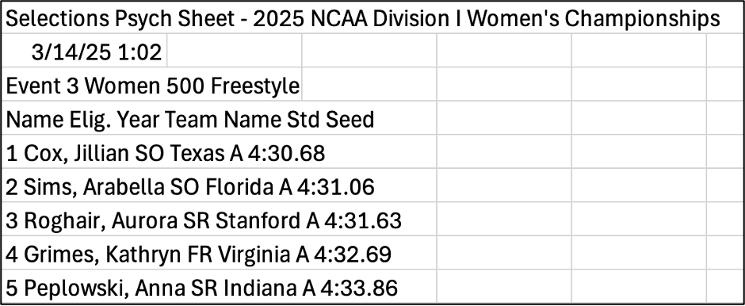
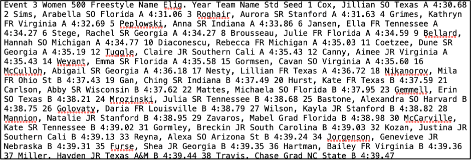
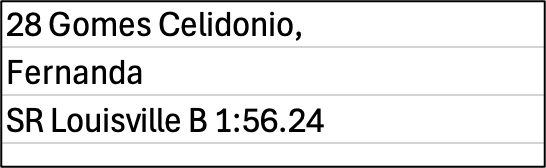
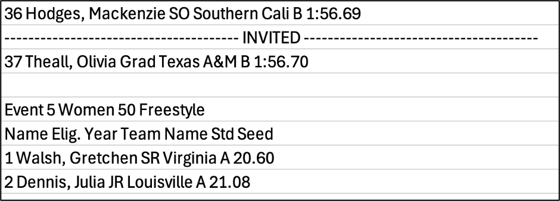
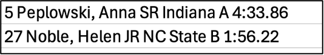
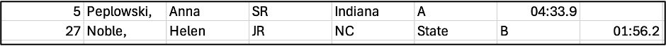

## Welcome to By the Lap!!

*"I want to change the sport of swimming. I want people to talk about it, think about it, and look forward to seeing it."  
– Michael Phelps*

Hello!

Welcome to **By the Lap**: Orly’s swim stat blog. 
I’m a competitive master’s swimmer with an (un)healthy obsession with NCAA and professional swimming. 
By day I work with data as an analyst, and I wanted to start bringing this love together with my love for swimming. 
Voila! Swim statistics blog.  

My main goals for this blog are:  
+ Create a public repository to show my code and data analysis approach
+ Have some fun with swim data using what I've learned in my statistics studies and my job experience

!!!! note **"The Dream:"** 
Be a part of making swim data more accessible and promote analytics to support swimming improvement.

!!! note "The Dream"

    Be a part of making swim data more accessible and promote analytics to support swimming improvement.

My background in statistics combined with my job experience since finishing school serve as the baseline for my data analysis approach. 
It continues to evolve, and I continue to learn more as I branch out. 
Right now I mainly work with budget data, and swimming data is far from that, but as I always say, data is data!! 
And I want it all.

What to expect:
+ A quote (which I used to do at every practice when I coached my college club team)
+ Detailed walk-throughs of overcoming challenges presented by doing analytics on sports data that is not easily available or usable
+ My data analysis approach
+ Code snippets
+ Swim headlines of my own (fueled by data!)

What’s the first topic!!

It was March Madness recently, and of course I am referring to NCAA swimming championships and not basketball. 
Land sports are stupid.

I wanted to look at the qualifiers for the women’s championship meet and go from there. 
Follow-up questions using results will be qualifiers by school vs. medalists, historical qualifiers, etc.

Men’s champs will come later. 
The first night was wild – with three DQs in the first relay! 
Florida blowing an early lead against Texas! 
This of course led to some questions about relay DQs in the past… another great topic we’ll get to.

The challenge in swimming analytics is that, unlike for basketball and football, data is not always readily accessible or in a usable format. 
For qualifiers for the NCAA championships, I have the pdf, and it took some finagling to get the data into a dataframe. 
I wanted to review this step by step because the joke about data science being 80% data cleaning and 20% analyzing data is inaccurate. 
It’s more like 90/10. I have the data! And I can’t use it! 
Let’s see what we can do.

Here is a snippet of the first page of the psych sheets:

There is somewhat of a structure and columns, but one thing missing is the event. 
I see it at the beginning of each event, but I will need to create a new column for each event so I know which event the entries belong to.

There is also a split between qualified and invited athletes per event. 
Athletes have to qualify for championships based on standards set using results from the previous year.  
There are also types of qualifications: A and B. I’ll come back to it.

To get this data into a dataframe, I first looked into scripts that could scrape a pdf. 
There is some good stuff out there, but truthfully, I wanted to try copying and pasting it first. 
I knew this might come with some manual work, but hey, that’s the best way to get to know the data! 

Here is a snippet of the original copy and paste from the pdf into Microsoft Excel:

I also tried saving it as a txt file, and then using code to separate by delimiters:

I attempted this way, but since there were so many nuances that were not systematic, it made more sense to stick with the Excel paste.

Now comes the fun part!!

There were a few things that had to be taken care of.

1. Long names, causing multiple rows for one entry (most names and information are on one row – here, the name and information is broken up, and has to be brought back together)

2. Adding Invited and Event columns (whether a swimmers qualified or was invited is noted here but has to be noted manually to create that as a categorical variable; the event is also only at the start of the entries for each one, so I have to add it on my own)

3. Delimiter separation by space, tracking school names (the second picture here is the split version of the first picture by the space – for schools with one name, that is fine, but some schools have two names, like NC State, it also gets split and has to be brought back together)

With some more twirls of the wand and a few breaks for snacks (okay fine, chocolate), I had myself a dataframe!! 
For my code friends out there, I changed my final Excel sheet into a csv first and then loaded it into python.

This first post was the intro to how this process looks from scratch. 
If you are into things like how many gold medals the US has ever won at the Olympics, or how many yards the Steelers offense ran last season, or how many points Michael Jordan scored from the foul line in the playoffs over the years, your data is easily accessible. 
If you are a swim stat nerd trying to do some analytics, your data is based on how much work you are going to put in to find it and clean it, or who you might know with access to more data. 
I’m excited to meet more people out there who are hungry for swimming data, whether at the NCAA level or otherwise. 
And I’m excited to share my code and insights with you! 

Welcome to From the Blocks!!

